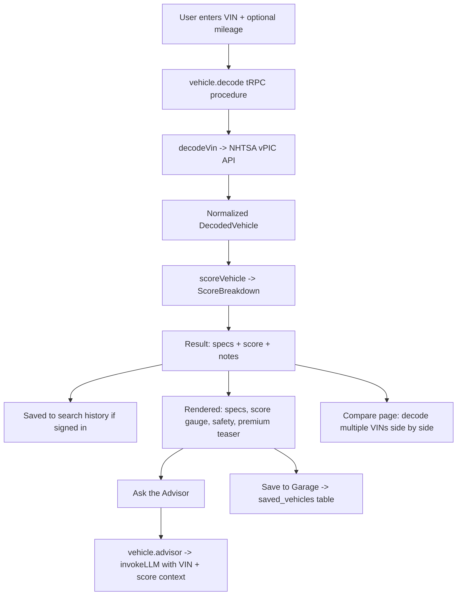

# GOGETTER AI Used Car Advisor

## Executive Summary

GOGETTER AI Used Car Advisor is a premium web application that helps shoppers decode, score, compare, and get AI-powered advice on used vehicles in one seamless experience. A buyer enters a Vehicle Identification Number (VIN); the application decodes the full factory specification from the free **NHTSA vPIC** public database, computes a transparent 0–100 quality score, and lets the user chat with an LLM-powered advisor that explains the score and offers personalized buying guidance. Vehicles can be saved to a personal garage, compared side by side, and revisited through a persistent search history. A premium teaser panel previews the private vehicle-history data (accident records, ownership count, and market value from **Carfax** and **CarGurus**) that a future paid tier would unlock.

## Core Features

| Feature | Description |
| --- | --- |
| VIN Lookup | Decodes make, model, year, engine, drivetrain, body class, and safety features via the free NHTSA vPIC API — no paid data source for core decoding. |
| Vehicle Scoring Engine | Produces an explainable 0–100 score from reliability heuristics, decoded safety features, age, mileage, and drivetrain efficiency, with four subscores and plain-language notes. |
| AI Conversational Advisor | An LLM-backed chat that answers questions about a specific decoded vehicle, explains its score, and gives buying recommendations grounded in the VIN data. |
| Vehicle Comparison | Decodes up to three VINs and presents their specs and scores in a parallel, easy-to-scan layout that highlights the top scorer. |
| Search History & Saved Garage | Persists each signed-in user's VIN searches and saved vehicles to the database for cross-session access. |
| Find My Car (discovery engine) | Filters and ranks local new/used inventory against a buyer profile (budget, distance, mileage, body/fuel, seller type, price-vs-reliability) into a short, explained shortlist. |
| Contact Seller | Ready-to-send message templates tailored for a private owner vs. a dealership (inquiry, offer, inspection, paperwork), with copy/email and optional AI personalization. |
| New-Car Trim Configurator | Pick a trim and option packages; price, MSRP, efficiency, and the GOGETTER quality score recompute live (safety packages feed the score). |
| Price-Drop Tracker & Alerts | Saved cars track their price (with a sparkline); saved searches and price drops surface as in-app notifications, refreshed by a scheduled monitor. |
| Premium Teaser Panel | Previews Carfax/CarGurus-sourced accident history, ownership count, and market value behind a blurred, clearly-labeled "coming soon" panel. |

## How It Works

The decode procedure normalizes the NHTSA response into a `DecodedVehicle`, the scoring engine derives a weighted overall score (reliability 40%, age & mileage 28%, safety 20%, efficiency 12%), and the advisor passes both objects to the LLM as structured context so its answers stay specific to the looked-up car.

## Tech Stack

The project runs **React 19 + Tailwind 4** on the client and a **tRPC 11** API on the server, with **Drizzle ORM** over **Neon serverless Postgres** and JWT cookie sessions (demo credential login) for authentication. It deploys to **Vercel** as a Vite static site plus serverless functions (the same tRPC router runs under a local Express dev server for HMR). The UI uses a dark "midnight showroom" theme with Fraunces serif headings and Inter body type.

## Deployment (Vercel)

`vercel.json` configures the static build (`vite build` → `dist/public`), SPA rewrites, the serverless API (`api/trpc/[trpc].ts`), and a daily cron that runs the price-drop / new-match monitor (`api/cron/monitor.ts`). Set `DATABASE_URL`, `JWT_SECRET`, optionally `LLM_API_URL`/`LLM_API_KEY`/`LLM_MODEL`, and `CRON_SECRET` in the Vercel project, run `pnpm db:push` once against the production database, and deploy. See [LOCAL_SETUP.md](LOCAL_SETUP.md) for the full walkthrough and the landing-page b-roll prompts in [docs/landing-video-prompts.md](docs/landing-video-prompts.md).

## Roadmap (not yet wired)

A licensed real-listings API (the provider boundary is ready), live Carfax/CarGurus history behind the premium tier, and email/SMS delivery for alerts (currently in-app only).

## Project Structure

| Path | Responsibility |
| --- | --- |
| `server/vin.ts` | VIN validation and NHTSA vPIC decoding. |
| `server/scoring.ts` | The explainable vehicle scoring engine. |
| `server/advisor.ts` | LLM advisor prompt construction and invocation. |
| `server/routers/vehicle.ts` | tRPC procedures: decode, advisor, save/unsave, history. |
| `server/db.ts` | Query helpers for history and saved vehicles. |
| `drizzle/schema.ts` | Database tables and shared decoded/score types. |
| `client/src/pages/` | Home, Compare, History, Saved, Premium, VehicleDetail. |
| `client/src/components/` | NavBar, VinSearchForm, VehicleResult, ScoreGauge, AdvisorChat, PremiumTeaser. |

## Testing

Run the suite with `pnpm test`. Coverage includes VIN structural validation (`server/vin.test.ts`), the scoring engine's bounds, grade mapping, reliability/safety/efficiency/mileage behavior (`server/scoring.test.ts`), and the auth logout flow.

## Disclaimers

VIN data is provided by the NHTSA vPIC public database. GOGETTER scores are advisory heuristic estimates, not guarantees of vehicle condition. The premium panel is a non-functional preview; no paid Carfax or CarGurus APIs are integrated.
