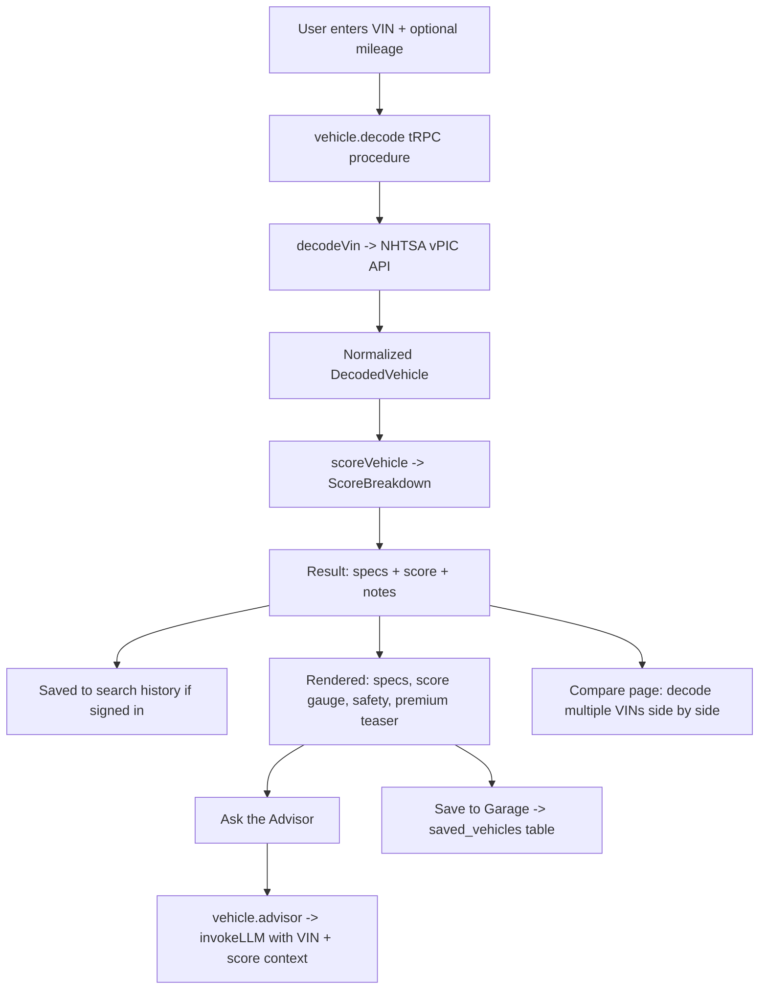

# GOGETTER AI Used Car Advisor

## Executive Summary

GOGETTER AI Used Car Advisor is a premium web application that helps shoppers decode, score, compare, and get AI-powered advice on used vehicles in one seamless experience. A buyer enters a Vehicle Identification Number (VIN); the application decodes the full factory specification from the free **NHTSA vPIC** public database, computes a transparent 0–100 quality score, and lets the user chat with an LLM-powered advisor that explains the score and offers personalized buying guidance. Vehicles can be saved to a personal garage, compared side by side, and revisited through a persistent search history. A premium teaser panel previews the private vehicle-history data (accident records, ownership count, and market value from **Carfax** and **CarGurus**) that a future paid tier would unlock.

## Core Features

| Feature | Description |
| --- | --- |
| VIN Lookup | Decodes make, model, year, engine, drivetrain, body class, and safety features via the free NHTSA vPIC API — no paid data source for core decoding. |
| Vehicle Scoring Engine | Produces an explainable 0–100 score from reliability heuristics, decoded safety features, age, mileage, and drivetrain efficiency, with four subscores and plain-language notes. |
| AI Conversational Advisor | An LLM-backed chat that answers questions about a specific decoded vehicle, explains its score, and gives buying recommendations grounded in the VIN data. |
| Vehicle Comparison | Decodes up to three VINs and presents their specs and scores in a parallel, easy-to-scan layout that highlights the top scorer. |
| Search History & Saved Garage | Persists each signed-in user's VIN searches and saved vehicles to the database for cross-session access. |
| Find My Car (discovery engine) | Filters and ranks local new/used inventory against a buyer profile (budget, distance, mileage, body/fuel, seller type, price-vs-reliability) into a short, explained shortlist. |
| Contact Seller | Ready-to-send message templates tailored for a private owner vs. a dealership (inquiry, offer, inspection, paperwork), with copy/email and optional AI personalization. |
| New-Car Trim Configurator | Pick a trim and option packages; price, MSRP, efficiency, and the GOGETTER quality score recompute live (safety packages feed the score). |
| Price-Drop Tracker & Alerts | Saved cars track their price (with a sparkline); saved searches and price drops surface as in-app notifications, refreshed by a scheduled monitor. |
| GOGETTER Reliability Index | A curated, versioned knowledge base of model-year-specific defects (Nissan Jatco CVT, Ford PowerShift, Hyundai Theta II…) and proven budget value picks (SkyActiv Mazda3, Honda Fit, Pontiac Vibe…) that feeds the score, the match ranking, the narratives, the advisor, and the checklists. Known defects cap a car's quality grade at D and trigger a "Don't walk away — RUN" callout; manual-transmission exceptions are handled (PowerShift/CVT warnings waive on a decoded manual). |
| Hybrid Natural-Language Search | Describe the need in plain English ("a safe, efficient car under $7k for my 15-year-old new driver within 30 miles of 22030") and the filters visibly set themselves — LLM-extracted when configured, with an always-on deterministic rules parser. Detected use cases (teen driver, commuter, family…) personalize the recommendations. |
| Budget Buyer Mode | One toggle productizes the budget golden rules: hides models with documented serious defects (reporting exactly how many were hidden), boosts curated value picks, and weights reliability heavily — because at budget prices, maintenance history beats brand name. |
| Seller Trust Signals | Rule-based "GOGETTER Approved" badges (real seller photos, tenure/CPO, franchise standing) and red flags — including a suspicious-deal detector for known-defect models priced too well for their age/mileage ("the seller may know what's coming"). |
| Pre-Purchase Action Plan | A personalized, copyable checklist per car: history report, ~$150 independent PPI, the three smart dealer questions to ask by phone (exact processing fee / send the history report now / absolute out-the-door price), private-sale title/lien steps, and model-specific checks from the Reliability Index. |
| Free Public Records (NHTSA Recalls) | Open recall campaigns pulled live from NHTSA's free public database for any make/model/year, with remedies and campaign numbers — the first live slice of the per-vehicle "micro layer". |
| Smart Zero-Result Guidance | When filters return nothing, the engine proposes one-click relaxations that are validated against inventory ("Widen the radius to 100 miles · +7") and surfaces curated value picks just outside the current filters. |
| Premium Teaser Panel | Previews Carfax/CarGurus-sourced accident history, ownership count, and market value behind a blurred, clearly-labeled "coming soon" panel — framed as Layer 2 of the dual-layer score (Layer 1, model-level intelligence, is live today). |

## How It Works

The decode procedure normalizes the NHTSA response into a `DecodedVehicle`, the scoring engine derives a weighted overall score (reliability 40%, age & mileage 28%, safety 20%, efficiency 12%), and the advisor passes both objects to the LLM as structured context so its answers stay specific to the looked-up car. The **GOGETTER Reliability Index** (`server/knowledge/`) adjusts the reliability subscore per model-year — hard avoids land in failing territory and cap the overall at D; curated value picks earn a bonus — and its advisories ride along on the score so the UI, advisor, and Garage all stay consistent.

## Replicating Eric's Successful Car-Buying Experience

This app productizes a real, successful used-car purchase that was researched manually with AI. The buyer needed a safe budget car for a new teen driver; hours of research surfaced the patterns now encoded in the Reliability Index:

- **The golden rule:** under ~$7,000, owner maintenance history matters more than brand name — a well-maintained Ford or Hyundai beats a neglected Toyota.
- **The traps:** suspiciously cheap, newer, low-mileage examples of known-defect models (2007–2017 automatic Nissans, 2012+ automatic Ford Focus/Fiesta, 2011–2016 Hyundai Elantra/Kia Forte…) are cheap because the seller can see the failure coming. The app flags these with a "Don't walk away — RUN" callout and a suspicious-deal warning.
- **The bargains:** value picks that dodge the "Toyota/Honda tax" — SkyActiv Mazda3, Honda Fit Magic Seats, the Pontiac Vibe (a Toyota Matrix at a dead-brand discount), Scion xB, and the 2008–2011 Duratec Ford Focus.
- **The process:** pull the history report first, ask the dealer three exact questions by phone before driving over, spend ~$150 on an independent pre-purchase inspection, and get an insurance quote *before* buying a theft-target model. Every recommended car ships with this checklist, personalized.

Try it: open **Find My Car**, paste *"a safe, efficient car under $7k for my 15-year-old new driver within 30 miles of 22030"*, hit **Interpret & set filters**, and search — with and without **Budget Buyer Mode**.

## Tech Stack

The project runs **React 19 + Tailwind 4** on the client and a **tRPC 11** API on the server, with **Drizzle ORM** over **Neon serverless Postgres** and JWT cookie sessions (demo credential login) for authentication. It deploys to **Vercel** as a Vite static site plus serverless functions (the same tRPC router runs under a local Express dev server for HMR). The UI uses a dark "midnight showroom" theme with Fraunces serif headings and Inter body type.

## Deployment (Vercel)

`vercel.json` configures the static build (`vite build` → `dist/public`), SPA rewrites, the serverless API (`api/trpc/[trpc].ts`), and a daily cron that runs the price-drop / new-match monitor (`api/cron/monitor.ts`). Set `DATABASE_URL`, `JWT_SECRET`, and `CRON_SECRET` in the Vercel project (plus any of the optional service keys below), run `pnpm db:push` once against the production database, and deploy. See [LOCAL_SETUP.md](LOCAL_SETUP.md) for the full walkthrough and the landing-page b-roll prompts in [docs/landing-video-prompts.md](docs/landing-video-prompts.md).

## Real-data cloud services (v7)

Five optional services replace mock paths with live data. **Every key is optional** — when one is missing, the matching feature falls back to the previous deterministic/seeded behavior (the full matrix lives in `.env.local.example`). Keys are read from env only and never logged; the client receives nothing but boolean service flags and the public Mapbox token via `config.public`.

| Service | Env var(s) | Powers |
|---|---|---|
| **Z.AI (GLM)** | `ZAI_API_KEY` | AI Advisor chat, per-match narratives, natural-language search parsing, contact drafts — via the existing OpenAI-compatible client (`server/_core/llm.ts`), which auto-targets Z.AI when the generic `LLM_*` vars are blank and downgrades `json_schema` → `json_object` (GLM doesn't support schemas). Default model `glm-4.5-flash` (free tier); set `LLM_MODEL=glm-4.7`/`glm-5.1` after funding the account. |
| **Pinecone** | `PINECONE_API_KEY` | Semantic search blended into Find-My-Car ranking (`semanticApplied`), the "More like this" section on vehicle detail, and advisor knowledge recall. Integrated-inference index (`gogetter-vehicles`, aws/us-east-1, Pinecone-hosted `llama-text-embed-v2` — no embedding key needed). Populate with **`pnpm sync:pinecone`** (idempotent; re-run after inventory/knowledge edits). |
| **Cloudinary** | `CLOUDINARY_URL` (+ key/secret for the sync script) | Optimized `f_auto,q_auto` CDN delivery for all listing photos. **`pnpm sync:cloudinary`** uploads each *unique* source image once and writes the committed manifest `server/inventory/photos.cloudinary.json`; the runtime is a pure URL builder (`server/images/cloudinary.ts`) — no SDK on the request path. |
| **Mapbox** | `MAPBOX_TOKEN` (public `pk.`, URL-restrict it) | The **`/map`** inventory explorer (dark-v11, gold price pins, popup report cards, filters — mapbox-gl ships in its own lazy chunk) and server-side Geocoding v6 for buyer ZIPs outside the seeded centroid table, so distance filtering uses real geography nationwide. |
| **Brave Search** | `BRAVE_SEARCH_API_KEY` | "Live market scan" on Find-My-Car (real Cars.com/AutoTrader/CarGurus/Craigslist listings for your criteria — opt-in click, since the API is metered) and the "From the web" owner-intel card + advisor web context on vehicle detail. Cached 6h server-side, ~1 rps throttled, never fired on page load. |

## Guided onboarding tour (v8)

First-time visitors get a corner slide-in offer (landing page + `/lookup`) for a **Quick Tour** (VIN lookup → score → AI advisor, ~2 min) or a **Full Tour** (everything: checklist, Find My Car, Budget Buyer Mode, Compare, Garage, History, ~5 min). Built on `driver.js` (lazy-loaded, ~5KB) with a midnight/gold-themed spotlight, progress indicator, and Back/Next/Esc controls — engine + steps + fixtures live in `client/src/tour/`. The tour runs entirely on **sample data**: seeded-inventory VINs (local), a fixture shortlist, and a scripted advisor transcript — zero NHTSA/LLM/Pinecone/Brave calls (the live panels are gated off while touring). Anonymous visitors who reach the Garage stop are signed into the shared demo account automatically. Completion/dismissal is remembered in localStorage for visitors and on the account (`users.onboarding`, reconciled at login) for signed-in users — the shared demo account is deliberately exempt from server persistence. Re-launch anytime from the "?" menu in the nav.

## Landing page & brand (v6)

`/` is now the public brand home — a GSAP scroll story under a **Three.js particle hero**: ~14,000 champagne-gold particles assemble into a procedural fastback silhouette (no 3D model download), parallax with the pointer, and disperse as you scroll into the story (pinned score build → the RUN stamp demo → cinematic b-roll → product tour). Everything degrades to a fully static page under `prefers-reduced-motion`, falls back to poster art without WebGL, and ships in lazy chunks (`Landing` ~54KB gz, three.js ~128KB gz) so the main app bundle is untouched. The VIN lookup moved to **`/lookup`**.

The **G-Gauge monogram** (a letter G whose mouth is a speedometer's redline gap, crossbar doubling as the needle) lives in `client/public/brand/` as hand-crafted SVG with PNG derivatives (`scripts/render-brand-pngs.mjs`), wired into the favicon set, OG/Twitter cards, NavBar, and footer. Browser QA is scripted in `scripts/qa-browser.mjs` (puppeteer-core + system Chrome): all routes × 4 breakpoints, console/overflow/FPS/reduced-motion checks.

## Login page (cinematic video background)

The `/login` route is a full-screen landing page with a **rotating background video**: muted, autoplaying, `playsInline` clips that play in a **shuffled order** (never the same one twice in a row) and **crossfade** into each other via two stacked, preloaded `<video>` layers. A dark "midnight showroom" scrim keeps the sign-in card and hero copy readable. It respects `prefers-reduced-motion` (shows a static poster), skips clips that fail to load, and falls back to the poster if none play — so the page always looks intentional.

Drop your clips into **`client/public/videos/`** (MP4) and list them in `LANDING_VIDEOS` in [client/src/pages/Login.tsx](client/src/pages/Login.tsx); the rotator/crossfade logic lives in [client/src/components/BackgroundVideo.tsx](client/src/components/BackgroundVideo.tsx). Ten ready-to-generate prompts are in [docs/landing-video-prompts.md](docs/landing-video-prompts.md). Keep each file lean (a few MB) for fast loads.

## Roadmap (not yet wired)

A licensed real-listings API (the provider boundary is ready — Marketcheck/Auto.dev feeds would also bring real per-car dealer photos straight through the Cloudinary sync), NMVTIS vehicle history (e.g. VinAudit) behind the premium tier, real valuations (VinAudit/Marketcheck price APIs), dealer reputation (Google Places/Yelp), free NHTSA complaints + SafetyRatings and EPA fueleconomy.gov enrichment, and email/SMS delivery for alerts (currently in-app only).

## Project Structure

| Path | Responsibility |
| --- | --- |
| `server/vin.ts` | VIN validation and NHTSA vPIC decoding. |
| `server/scoring.ts` | The explainable vehicle scoring engine (knowledge-adjusted). |
| `server/knowledge/` | The GOGETTER Reliability Index: curated model-year entries (`data.ts`), lookup with alias/year/engine/manual-transmission handling (`lookup.ts`). |
| `server/search/intent.ts` | Natural-language → criteria parsing (LLM structured output + deterministic rules fallback). |
| `server/checklist.ts` | Deterministic, personalized pre-purchase checklist builder. |
| `server/recalls.ts` | Free NHTSA recall lookup (timeout, cache, null-safe). |
| `server/inventory/trust.ts` | Rule-based seller trust signals + suspicious-deal detector. |
| `server/inventory/data.curated.json` | Curated demo listings (reliability traps + value picks) kept separate so regenerating `data.json` never wipes them. |
| `server/advisor.ts` | LLM advisor prompt construction and invocation (knowledge-aware). |
| `server/routers/vehicle.ts` | tRPC procedures: decode, advisor, recalls, save/unsave, history. |
| `server/routers/find.ts` | Discovery: search, parseIntent, checklist, facets, saved searches. |
| `server/db.ts` | Query helpers for history and saved vehicles. |
| `drizzle/schema.ts` | Database tables and shared decoded/score/advisory types. |
| `client/src/pages/` | Home, FindMyCar, Compare, History, Saved, Premium, VehicleDetail. |
| `client/src/components/` | NavBar, VinSearchForm, VehicleResult, ScoreGauge, AdvisorChat, MatchCard, AdvisoryCallout, ChecklistCard, PublicRecords, PremiumTeaser. |

## Testing

Run the suite with `pnpm test` (118 tests). Coverage includes VIN structural validation, the scoring engine's bounds/grade mapping and its knowledge-base integration (trap penalties, value-pick bonuses, manual-transmission waivers), the Reliability Index lookup semantics, inventory matching with Budget Buyer Mode and trust signals, the deterministic intent parser, the checklist builder, NHTSA recall fetching (mocked), router-level backward compatibility for legacy saved-search criteria, and the auth flows.

## Disclaimers

VIN data is provided by the NHTSA vPIC public database. GOGETTER scores are advisory heuristic estimates, not guarantees of vehicle condition. The premium panel is a non-functional preview; no paid Carfax or CarGurus APIs are integrated.
